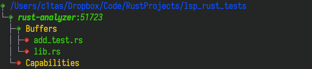

# autocomplete not work in tests folder

sry for my poor english.

I use command as follow to create this project

``` bash
cargo new --lib lsp_rust_tests
cd lsp_rust_tests
mkdir -p tests
```

> first

edit `src/lib.rs` file

```rust
pub fn add_2(num: i32) -> i32 {
    num + 2
}

#[cfg(test)]
mod tests {
    use super::*;
    #[test]
    fn it_works() {
        assert_eq!(2 + 2, 4);
    }

    #[test]
    fn add_2_test() {
        assert_eq!(4, add_2(2));
    }
}

```

autocomplete works in this file;

> second

edit `tests/add_test.rs`

```rust
use lsp_rust_tests;
#[test]
fn test() {
    assert_eq!(4, lsp_rust_tests::add_2(2));
}
```

autocomplete in this file not work;

> lsp-describe-session




## other question

when I create and edit some new file in src folder like `src/utils.rs`

if there is no `mod utils` in my `lib.rs`, autocomplete will not work at all.

after i add `mod uitls`, it works.
